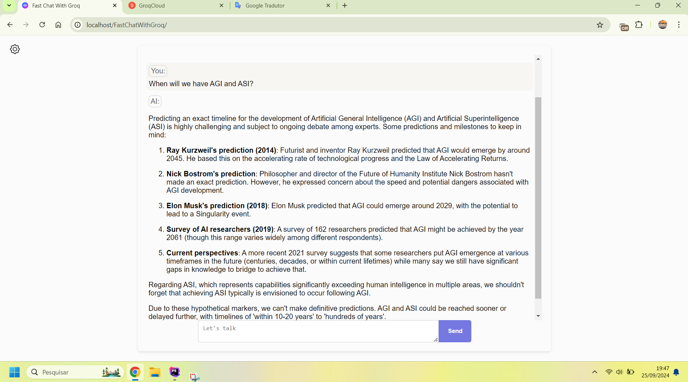

# FastChatWithGroq: Open-Source Web Interface for Groq Inference API

## New Project
New project here: https://github.com/EliasPereirah/OrionChat

Now you can talk not just with Groq models but with a lot more.

check it out: https://github.com/EliasPereirah/OrionChat

**FastChatWithGroq** is an open-source, web-based application that allows you to interact with Groq LLMs available models
seamlessly using your own API key.

## 🌟 Key Features

- 🚀 **Easy Setup**: Just add your Groq API key and you're ready to start chatting.
- 💬 **Intuitive Interface**: A user-friendly chat interface for smooth interactions with Groq open models.
- 🔒 **Secure**: Your API key is securely stored locally and never shared.
- 🎨 **Customizable**: Easily tweak the design and functionality to suit your preferences.
- 📱 **Responsive Design**: Optimized for both desktop and mobile devices.



## 🚀 Getting Started

### Prerequisites

- A valid Groq API key. [Get your free API key here](https://console.groq.com/keys).
- If you prefer not to install it locally, you can try the chat interface [here](https://eliaspereirah.github.io/FastChatWithGroq/).

> 🔐 **Note**: Your API key is only sent directly to Groq servers and is not shared elsewhere.

### Installation

1. Clone this repository:
   ```bash
   git clone https://github.com/EliasPereirah/FastChatWithGroq.git
   ```
2. Launch the app using a local server. Example: [http://localhost/FastChatWithGroq](http://localhost/FastChatWithGroq).

## 🛠️ Usage

1. Enter your Groq API key in the provided field.
2. Start chatting with Groq AI models in the main interface.
3. Experience intelligent conversations powered by cutting-edge AI!

## 🤝 Contributing

We welcome contributions! Feel free to fork the repository, make changes, and submit a pull request. Let's improve this project together!

## 📄 License

This project is licensed under the MIT License. See the [LICENSE](LICENSE) file for more details.

## ⚠️ Disclaimer

This project is not affiliated with or officially endorsed by Groq.
